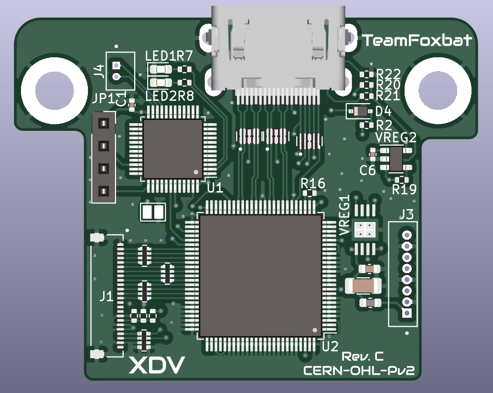

# XDV
100% digital-to-digital video encoder inspired by existing projects for the Original Xbox. Currently no firmware released but is compatible with existing digital video encoding solutions.

## Installation Notes
The v1.0-1.4 Xbox boards have a big electrolytic cap next to the stock encoder that will interfere with installation. Recommendation is to replace with a S1206 10uF ceramic.

The ferite bead on the bottom right of the stock encoder must be removed. 

Notes for installing the power and SMBus harnesses to come soon.

## Status Update
The Rev B board (not available here) does successfully take MakeMHz XboxHD+ firmware but has some visual glitches likely due to the flex PCB (not publicly available yet). Further work needs to be done to determine the cause but it's likely the flex.

The Rev C offers some minor improvements to reduce impedence mismatch on the TMDS traces but has not been ordered, a minor improvement to get closer to the spec.

